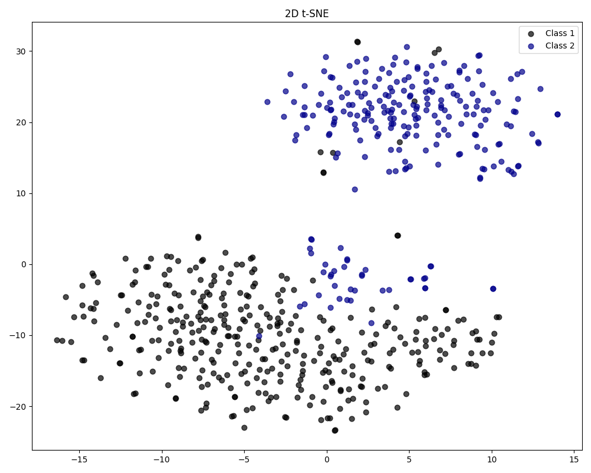
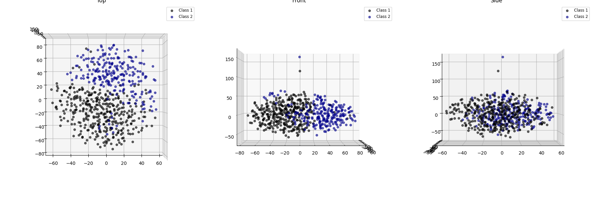
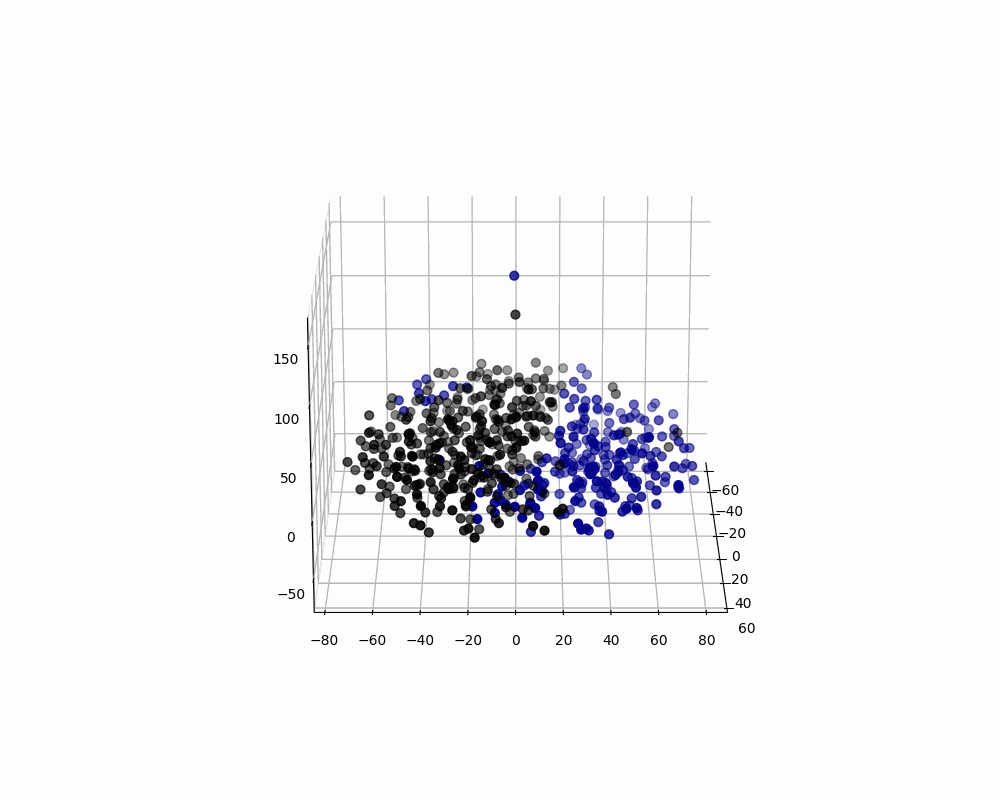
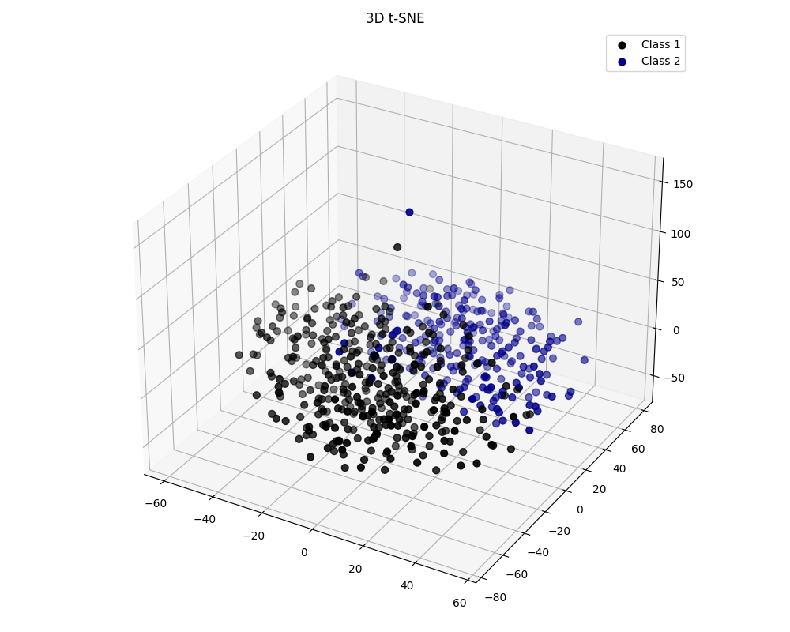
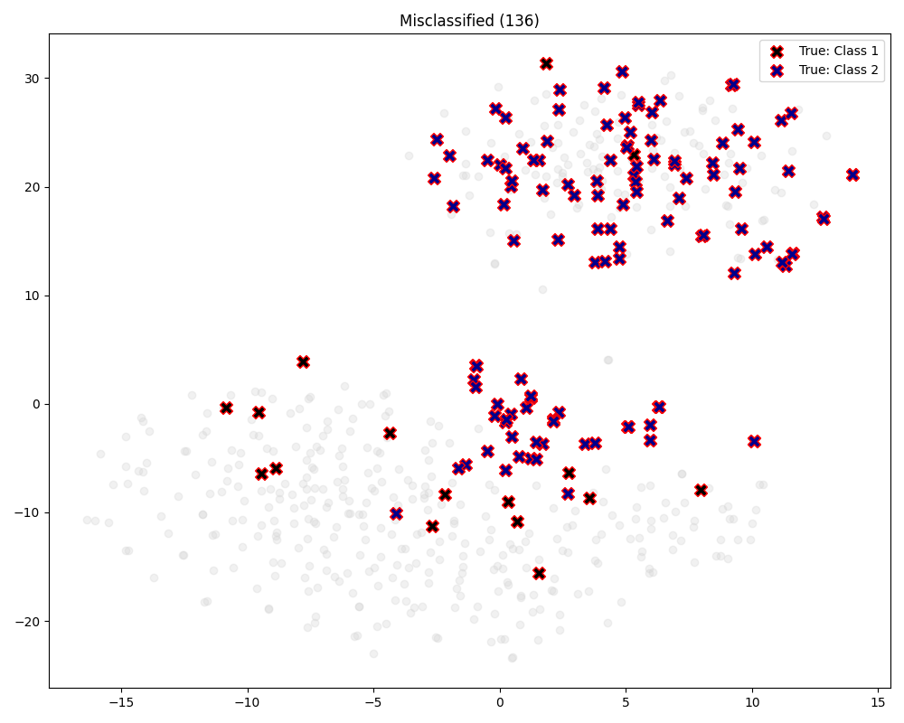
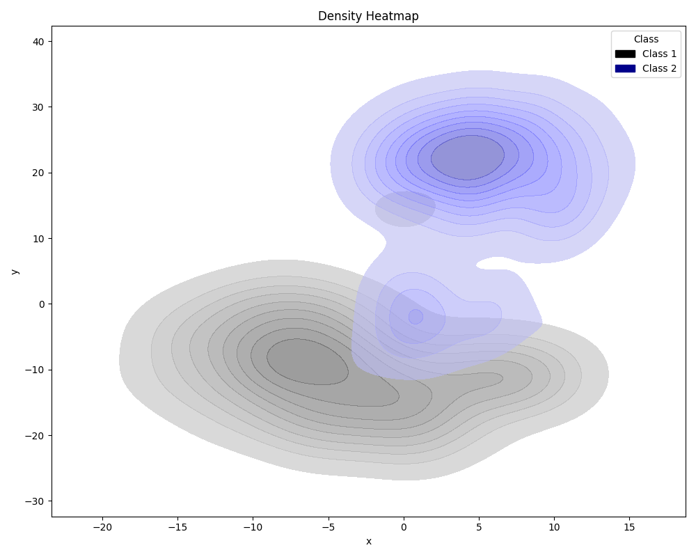

# 📊 Deep Learning Visualization Toolbox (PyTorch)

A comprehensive repository for advanced visualization techniques in Deep Learning. 
**Current Module:** An all-in-one **t-SNE Visualization Class** for classification tasks.

This repository provides a robust implementation to convert high-dimensional feature maps into meaningful, interpretable charts. It covers the full spectrum of t-SNE analysis, from standard 2D scatter plots to 3D interactive visualizations.

## ✨ Features (The t-SNE Module)

This tool generates **7 different types of visualizations** from a single model execution:

1.  **2D t-SNE:** Standard scatter plot to visualize class separability.
2.  **3D t-SNE:** Full spatial visualization of the feature manifold.
3.  **Density Heatmap:** Kernel Density Estimation (KDE) to identify high-density clusters.
4.  **Misclassified Analysis:** Automatically detects, highlights, and marks samples where `Prediction != Label` (Essential for debugging).
5.  **3-View Engineering Plot:** Simultaneous Top, Front, and Side views with legends for precise structural analysis.
6.  **Interactive Plot (HTML):** A fully interactive Plotly chart to zoom, pan, and hover over data points to see filenames and confidence scores.
7.  **360° Rotating GIF:** A smooth, rotating animation of the 3D cluster for presentations and reports.

## 📂 Repository Structure

- `tsne_viz.py`: The main source code containing the `jd_tsne_cl` class (The Engine).
- `assets/`: Gallery of generated outputs.

*(Usage examples are included at the bottom of the main script)*

## 🚀 Usage

You can use the provided class to visualize any PyTorch classification model (ResNet, VGG, Custom CNNs, etc.).

### Step 1: Setup
Ensure you have the required libraries:
```bash
pip install torch matplotlib scikit-learn seaborn plotly pandas tqdm
```
### Step 2: Run the Code
Download tsne_viz.py and run it. You can modify the bottom section of the script to load your own model:
```bash
if __name__ == "__main__":
    from tsne_viz import jd_tsne_cl
    
    # 1. Initialize with your trained model
    # visualizer = jd_tsne_cl(model=my_model, device='cuda')

    # 2. Extract Features from your DataLoader
    # visualizer.extract_and_compute(test_loader)

    # 3. Generate ALL plots
    # visualizer.plot(class_names=['Class A', 'Class B'], modes=['all'])
```
## 📸 Gallery

| 2D plot | 3-View plots |
| :---: | :---: |
|  |  |

| 3D Rotation | 3D plot |
| :---: | :---: |
|  |  |

| Misclassified Detection | Density Heatmap |
| :---: | :---: |
|  |  |

---
*This repository is actively maintained. New visualization modules will be added soon.*
